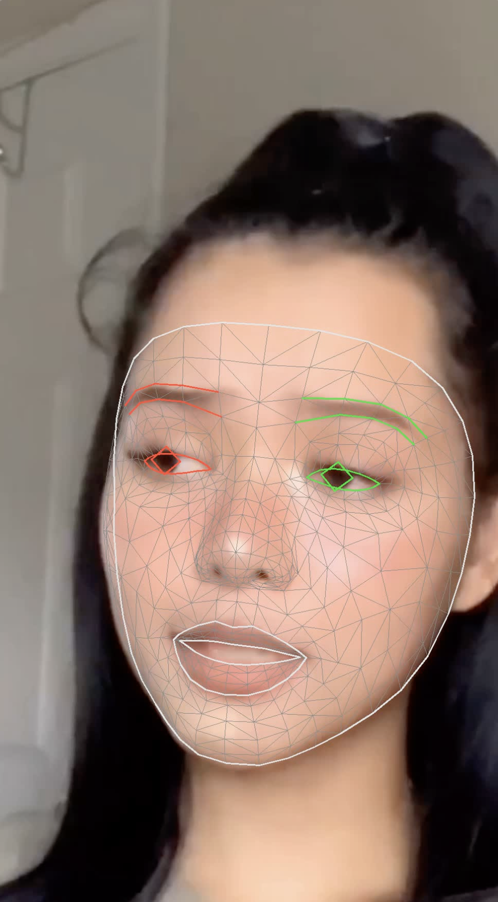
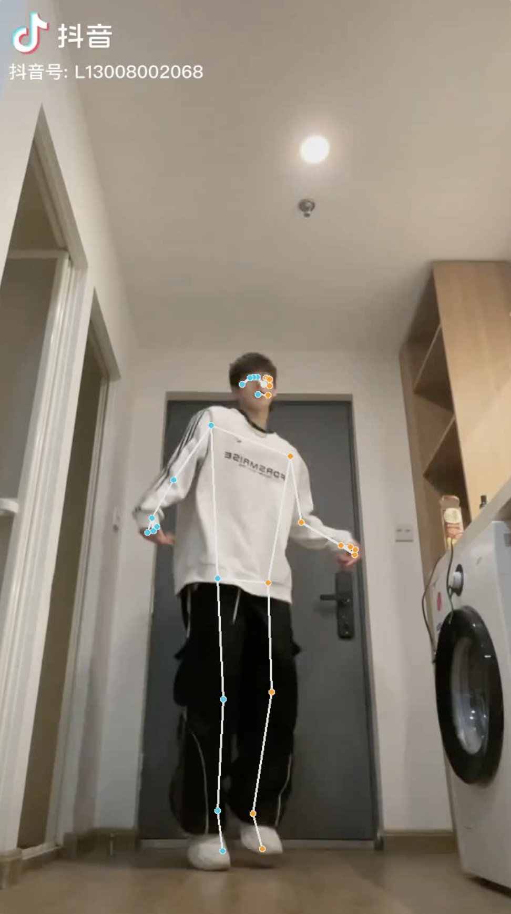
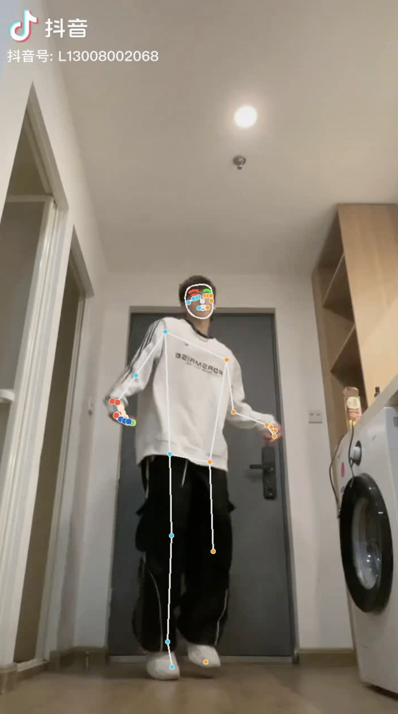

# PoseEstimation

## Introduction

Implementing Human Pose Estimation Combination of the DigiHuman Project and the MediaPipe .
This approach can estimate the human pose in a single image or a video, and visualize the results directly onto the corresponding image/video. The key point information will be saved in JSON data format. In the future, we will also consider incorporating some tips and techniques for using DensePose.

Pose_Estimate.py is reproduced using the core code in Digihuman. Pose_Estimate2.py is further optimized using the latest python library. Face_Estimate.py is also implemented using the latest library code


## Running Demo

```bash
git clone https://github.com/PlanktonQAQ/PoseEstimation.git

python Pose_Estimate2.py

```


## Result

<div style="display: flex; justify-content: center; align-items: center;">
  
  
</div>


<div style="display: flex; justify-content: center; align-items: center;">
  
  
  
</div>


